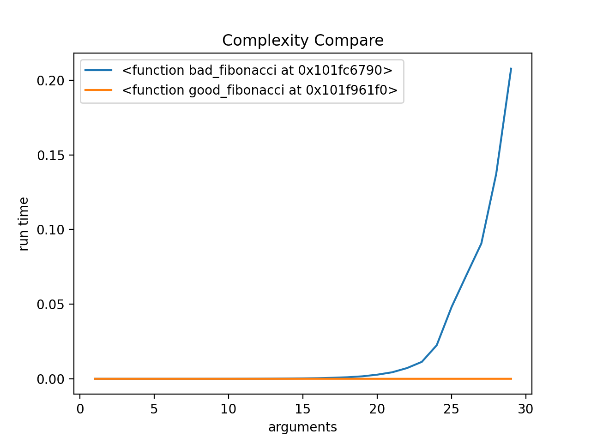

## Complexity

**A Simple Program that help do Complexity Analysis(Time)**

#### Example
```python
# gb_fibonacci.py

import Complexity


def bad_fibonacci(n):
    """return the No.n fibonacci number

    it is bad code
    """
    if n <= 1:
        return n
    else:
        return bad_fibonacci(n-1) + bad_fibonacci(n-2)


def good_fibonacci(n):
    """return pair of fibonacci numbers, F(n) and F(n-1)

    it is good code:)
    """
    if n <= 1:
        return (n, 0)
    else:
        (a, b) = good_fibonacci(n-1)
        return(a+b, a)

```
**If We Use Complexity. We will get that Table:<br>**



**Reflects the relationship between the time complexity and parameter size of different functions**


#### Interface

```python
bf = Complexity.Complexity(bad_fibonacci)
bf.set_first_element(1)
bf.set_test_range(0, 30, 1)
bf.statistics()
bf.draw()

gf = Complexity.Complexity(good_fibonacci)
gf.set_first_element(1)
gf.set_test_range(0, 30, 1)
gf.statistics()
gf.draw()

Complexity.Compare(bf, gf)

```

