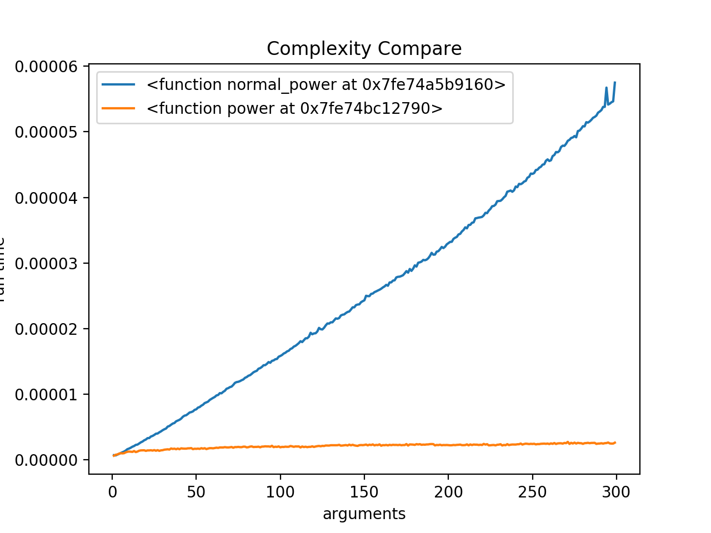
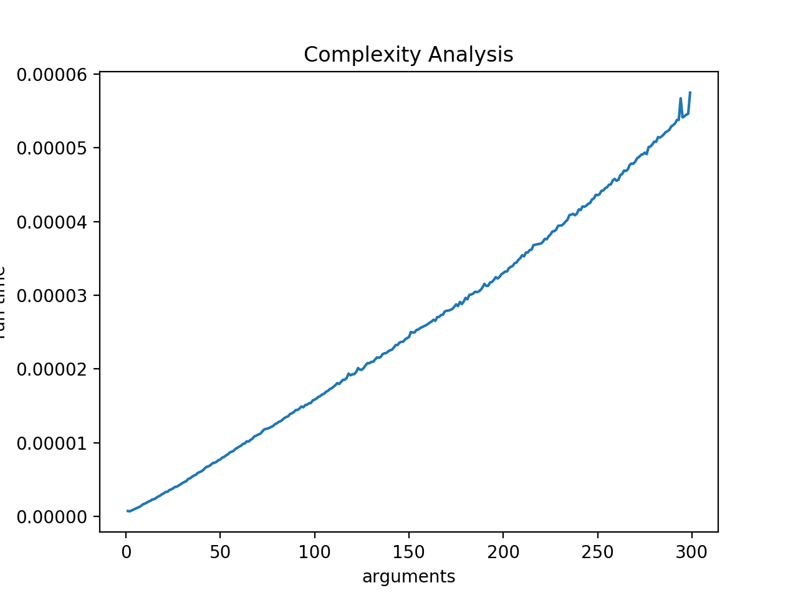
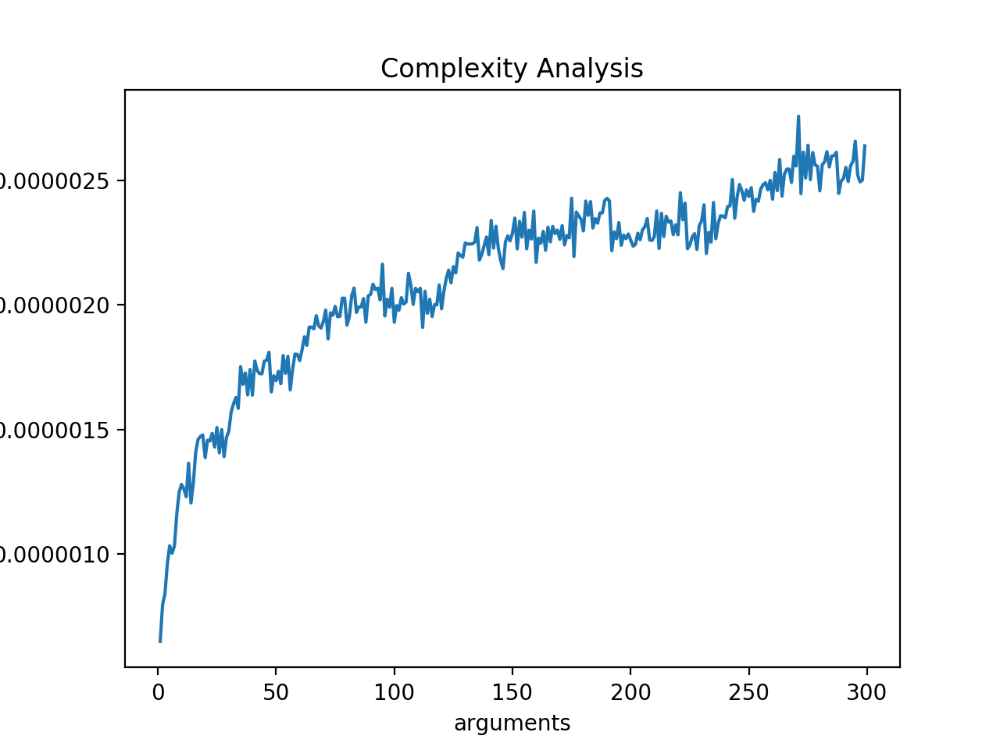

## Complexity

**A Simple Program that help do Complexity Analysis(Time)**

#### Example
```python
# gb_fibonacci.py
import Complexity


def normal_power(x, n):
    """Complexity: O(n)"""
    if n == 0:
        return 1
    else:
        return x * normal_power(x, n-1)


def power(x, n):
    """Complexity: O(log n)"""
    if n == 0:
        return 1
    else:
        partial = power(x, n // 2)
        result = partial * partial
        if n % 2 == 1:
            result *= x
        return result

```
**If We Use Complexity. We will get that Table:<br>**



**And Also each of them:**


**normal_power(Complexity: O(n))**


**power(Complexity: O(log n))**


**Reflects the relationship between the time complexity and parameter size of different functions<br>**


#### Interface


```python
np = Complexity.Complexity(normal_power)
np.set_first_element(2)
np.set_second_element(1)
np.set_test_range(1, 300, 1)
np.average(1000)
np.draw()

p = Complexity.Complexity(power)
p.set_first_element(2)
p.set_second_element(1)
p.set_test_range(1, 300, 1)
p.average(1000)
p.draw()

Complexity.Compare(np, p)

```
