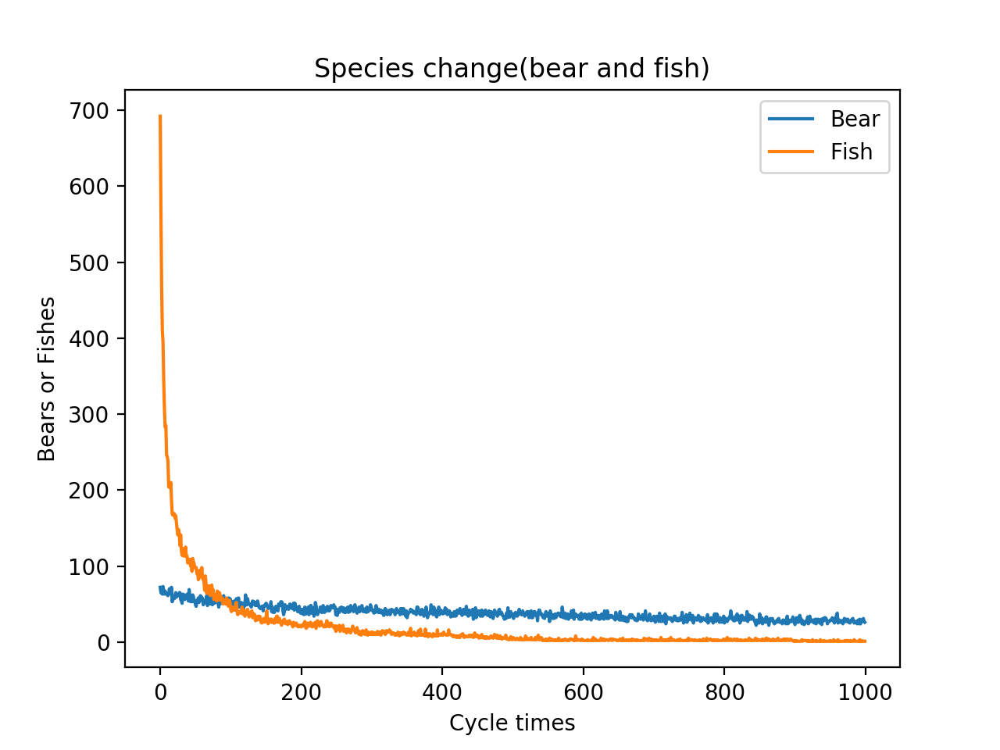

## Ecosysterm

**A Simulated Ecosystem**

```python
# Test Interface
def Test(eco, term, fish, bear):
    X = [] YF = []
    YB = []
    F = 0
    B = 0
    TERMS = term
    EcoSysterm.set_eco(eco)
    for j in range(fish):
        EcoSysterm.Fish().goto()

    for j in range(bear):
        EcoSysterm.Bear().goto()

    for i in range(TERMS):
        """Cycle"""
        for j in EcoSysterm.ecosysterm:
            if isinstance(j, EcoSysterm.Bear):
                B += 1
                j.M_S()
            elif isinstance(j, EcoSysterm.Fish):
                F += 1
                j.M_S()
        X.append(i)
        YB.append(B)
        YF.append(F)
        F = 0
        B = 0

    """Draw"""

    plt.plot(X, YB)
    plt.plot(X, YF)
    plt.title("Species change(bear and fish)")
    plt.xlabel('Cycle times')
    plt.ylabel('Bears or Fishes')
    plt.legend(["Bear", "Fish"])
    plt.show()


if __name__ == "__main__":
    eco = int(input("Range of EcoSysterm: "))
    term = int(input("Cycle Terms: "))
    fish = int(input("Number of Fish: "))
    bear = int(input("Number of Bear: "))
    Test(eco, term, fish, bear)

```


##### Find The Relationship Between Range of Ecosysterm and Cycle terms:


```
Test1:
➜  EcoSysterm (master) ✗ python3 Test.py
Range of EcoSysterm: 50
Cycle Terms: 1000
Number of Fish: 50
Number of Bear: 5

```


```
Test2:
➜  EcoSysterm (master) ✗ python3 Test.py
Range of EcoSysterm: 1000
Cycle Terms: 1000
Number of Fish: 1000
Number of Bear: 100
```


##### Find the Relationship Between dominant species and disadvantaged species(porportion)


```
➜  EcoSysterm (master) ✗ python3 Test.py
Range of EcoSysterm: 1000
Cycle Terms: 10000
Number of Fish: 1000
Number of Bear: 100
```


```
➜  EcoSysterm (master) ✗ python3 Test.py
Range of EcoSysterm: 1000
Cycle Terms: 1000
Number of Fish: 500
Number of Bear: 500
```


```
➜  EcoSysterm (master) ✗ python3 Test.py
Range of EcoSysterm: 1000
Cycle Terms: 1000
Number of Fish: 700
Number of Bear: 300
```


```
➜  EcoSysterm (master) ✗ python3 Test.py
Range of EcoSysterm: 1000
Cycle Terms: 1000
Number of Fish: 900
Number of Bear: 100
```



```
➜  EcoSysterm (master) ✗ python3 Test.py
Range of EcoSysterm: 1000
Cycle Terms: 1000
Number of Fish: 950
Number of Bear: 50
```


```
➜  EcoSysterm (master) ✗ python3 Test.py
Range of EcoSysterm: 1000
Cycle Terms: 1000
Number of Fish: 975
Number of Bear: 25
```


```
➜  EcoSysterm (master) ✗ python3 Test.py
Range of EcoSysterm: 1000
Cycle Terms: 10000
Number of Fish: 985
Number of Bear: 15
```


```
➜  EcoSysterm (master) ✗ python3 Test.py
Range of EcoSysterm: 1000
Cycle Terms: 10000
Number of Fish: 1020
Number of Bear: 10
```

