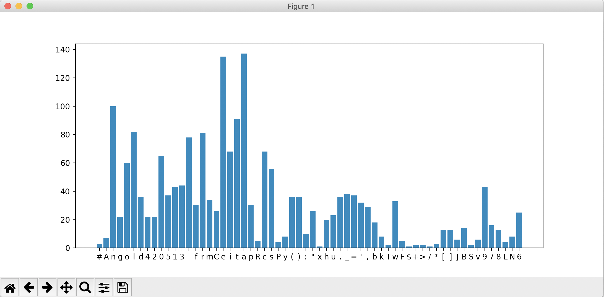
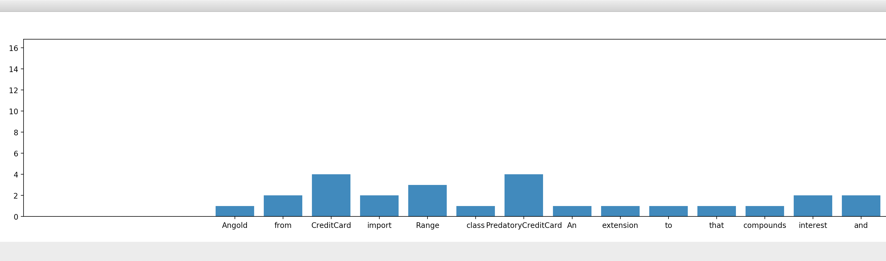
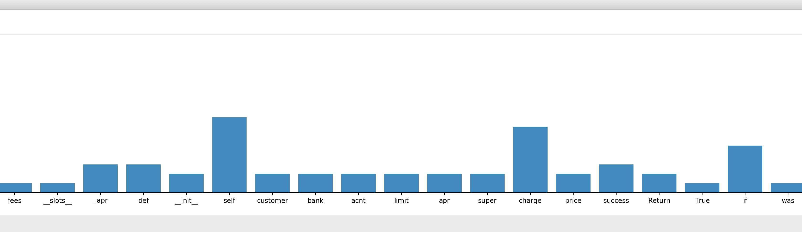
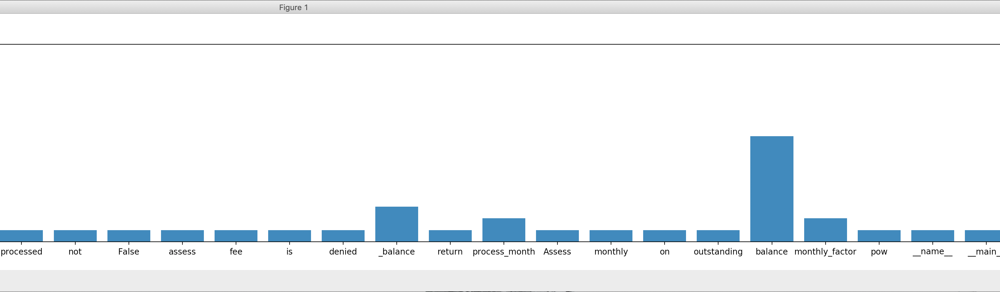
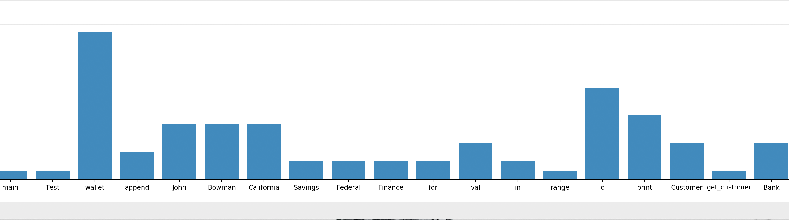
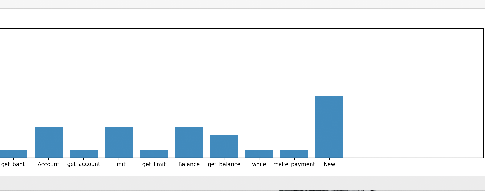

### FileSysterm

**A File Systerm That Can Do Many Things**

```python
# Test Interface
def Test():
    print("Check __init__ ...")
    _file = File('PCreditCard.py', '/Users/Angold4/WorkSpace/algorithms_in_python/Chapters/Chapter_2')
    print("Finished")
    print('')

    print("Check get_filename() and get_filepath() ...")
    _name = _file.get_filename()
    _path = _file.get_filepath()
    print("Name:", _name, "Path:", _path)
    print("Finished")
    print('')

    print("Check get_content()...")
    _content = _file.get_content()
    print(_content)
    print("Finished!")
    print('')

    print("Check get_lines()...")
    _lines = _file.get_lines()
    print("Lines:", _lines)
    print("Finished")
    print('')

    print("Check count_letter()...")
    _n = _file.count_letter('p')
    print("Number of p:", _n)
    print("Finished")
    print('')

    print("Check count_word()...")
    _n = _file.count_word('print')
    print("Number of print:", _n)
    print("Finished")
    print('')

    print("Check count_letters()...")
    print(_file.count_letters(True))
    print("Finished")
    print('')

    print("Check count_words()...")
    print(_file.count_words(True))
    print("Finished")
    print('')

```

```
Check __init__ ...
Finished

Check get_filename() and get_filepath() ...
Name: PCreditCard.py Path: /Users/Angold4/WorkSpace/algorithms_in_python/Chapters/Chapter_2/PCreditCard.py
Finished

Check get_content()...
# Angold4 20200513
from CreditCard import CreditCard
from Range import Range


class PredatoryCreditCard(CreditCard):
    """An extension to CreditCard that compounds interest and fees."""
    __slots__ = '_apr'

    def __init__(self, customer, bank, acnt, limit, apr):
        super().__init__(customer, bank, acnt, limit)
        self._apr = apr

    def charge(self, price):
        success = super().charge(price)  # Return True if charge was processed
        if not success:  # Return False and assess $5 fee if charge is denied
            self._balance += 5
        return success

    def process_month(self):
        """Assess monthly interest on outstanding balance"""
        if self._balance > 0:
            monthly_factor = pow(1 + self._apr, 1/12)
            self._balance *= monthly_factor


if __name__ == "__main__":
    """Test"""
    wallet = []
    wallet.append(PredatoryCreditCard('John Bowman', 'California Savings',
                                      '5391 0375 9387 5309', 2500, 0.0825))
    wallet.append(PredatoryCreditCard('John Bowman', 'California Federal',
                                      '3485 0399 3395 1954', 3500, 0.0800))
    wallet.append(PredatoryCreditCard('John Bowman', 'California Finance',
                                      '5391 0375 9387 5309', 5000, 0.0750))
    for val in range(1, 17):
        wallet[0].charge(val)
        wallet[1].charge(2*val)
        wallet[2].charge(3*val)

    for c in Range(3):
        wallet[c].process_month()
        print('Customer =', wallet[c].get_customer())
        print('Bank =', wallet[c].get_bank())
        print('Account =', wallet[c].get_account())
        print('Limit =', wallet[c].get_limit())
        print('Balance =', wallet[c].get_balance())
        while wallet[c].get_balance() > 100:
            wallet[c].make_payment(100)
            print('New balance =', wallet[c].get_balance())
        print()

"""
Customer = John Bowman
Bank = California Savings
Account = 5391 0375 9387 5309
Limit = 2500
Balance = 136.90140348539404
New balance = 36.90140348539404

Customer = John Bowman
Bank = California Federal
Account = 3485 0399 3395 1954
Limit = 3500
Balance = 273.75005618992094
New balance = 173.75005618992094
New balance = 73.75005618992094

Customer = John Bowman
Bank = California Finance
Account = 5391 0375 9387 5309
Limit = 5000
Balance = 410.466326961911
New balance = 310.466326961911
New balance = 210.46632696191102
New balance = 110.46632696191102
New balance = 10.466326961911022
"""

Finished!

Check get_lines()...
Lines: 78
Finished

Check count_letter()...
Number of p: 30
Finished

Check count_word()...
Number of print: 7
Finished
```
```python
Check count_letters()...
{'#': 3, 'A': 7, 'n': 100, 'g': 22, 'o': 60, 'l': 82, 'd': 36, '4': 22, '2': 22, '0': 65, '5': 37, '1': 43, '3': 44, '\n': 78, 'f': 30, 'r': 81, 'm': 34, 'C': 26, 'e': 135, 'i': 68, 't': 91, 'a': 137, 'p': 30, 'R': 5, 'c': 68, 's': 56, 'P': 4, 'y': 8, '(': 36, ')': 36, ':': 10, '"': 26, 'x': 1, 'h': 20, 'u': 23, '.': 36, '_': 38, '=': 37, "'": 32, ',': 29, 'b': 18, 'k': 8, 'T': 2, 'w': 33, 'F': 5, '$': 1, '+': 2, '>': 2, '/': 1, '*': 3, '[': 13, ']': 13, 'J': 6, 'B': 14, 'S': 2, 'v': 6, '9': 43, '7': 16, '8': 13, 'L': 4, 'N': 8, '6': 25}
Finished
```

```python
Check count_words()...
{'Angold': 1, 'from': 2, 'CreditCard': 4, 'import': 2, 'Range': 3, 'class': 1, 'PredatoryCreditCard': 4, 'An': 1, 'extension': 1, 'to': 1, 'that': 1, 'compounds': 1, 'interest': 2, 'and': 2, 'fees': 1, '__slots__': 1, '_apr': 3, 'def': 3, '__init__': 2, 'self': 8, 'customer': 2, 'bank': 2, 'acnt': 2, 'limit': 2, 'apr': 2, 'super': 2, 'charge': 7, 'price': 2, 'success': 3, 'Return': 2, 'True': 1, 'if': 5, 'was': 1, 'processed': 1, 'not': 1, 'False': 1, 'assess': 1, 'fee': 1, 'is': 1, 'denied': 1, '_balance': 3, 'return': 1, 'process_month': 2, 'Assess': 1, 'monthly': 1, 'on': 1, 'outstanding': 1, 'balance': 9, 'monthly_factor': 2, 'pow': 1, '__name__': 1, '__main__': 1, 'Test': 1, 'wallet': 16, 'append': 3, 'John': 6, 'Bowman': 6, 'California': 6, 'Savings': 2, 'Federal': 2, 'Finance': 2, 'for': 2, 'val': 4, 'in': 2, 'range': 1, 'c': 10, 'print': 7, 'Customer': 4, 'get_customer': 1, 'Bank': 4, 'get_bank': 1, 'Account': 4, 'get_account': 1, 'Limit': 4, 'get_limit': 1, 'Balance': 4, 'get_balance': 3, 'while': 1, 'make_payment': 1, 'New': 8}
Finished
```






